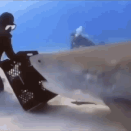

# GetRotated

- Using a neural network to rotate images, because I can

### modeling choices
An intuitive solution would be that every pixel will be shifted among it's radius, 
therefore following attributes would make sense:
- a single fully connected layer

- disabled bias

## Results

