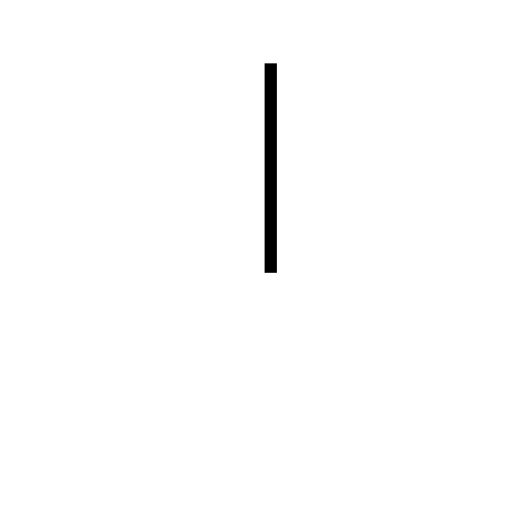
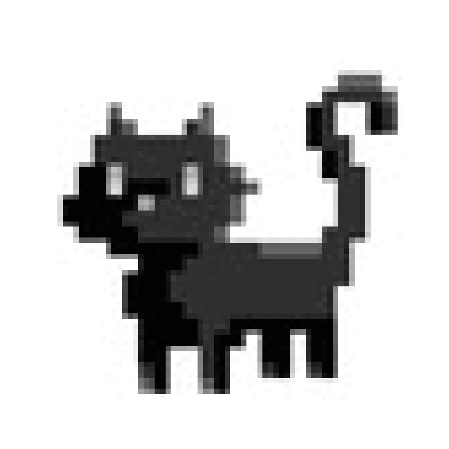
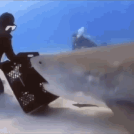

# GetRotated

Using a neural network to rotate images, because I can

### modeling choices
In the expected solution every pixel would be shifted among its radius, 
this is possible using a single fully connected layer, with deactivated bias

### interesting insights
It turned out to be quite effective using different data at different
stages of model training. Gradually increasing the amount of points,
until the given image becomes pure uniform noise

## Results

